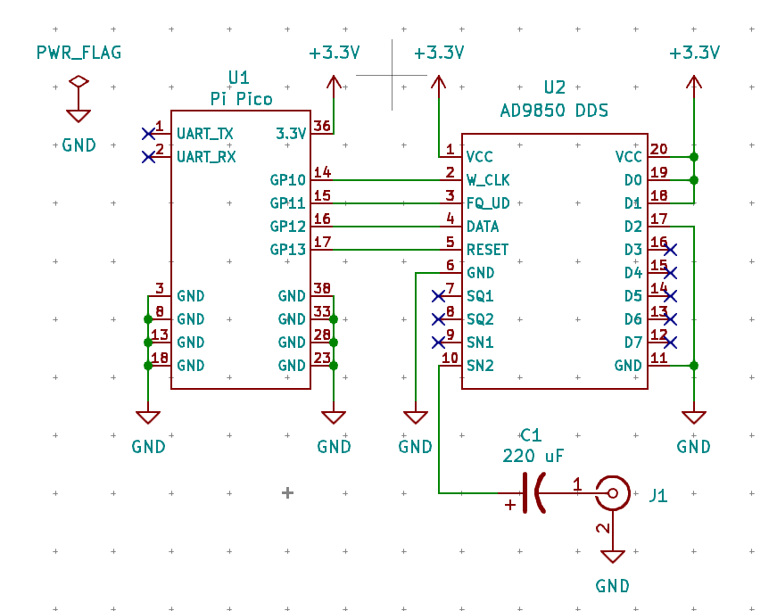
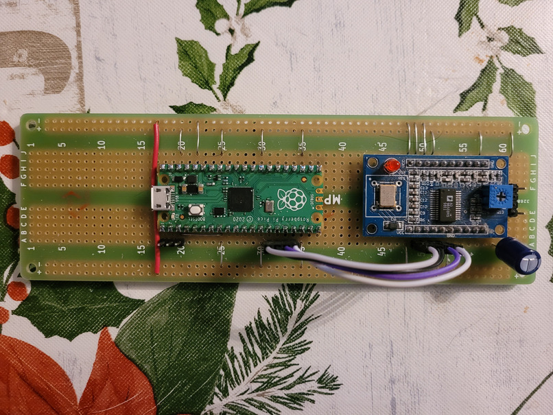
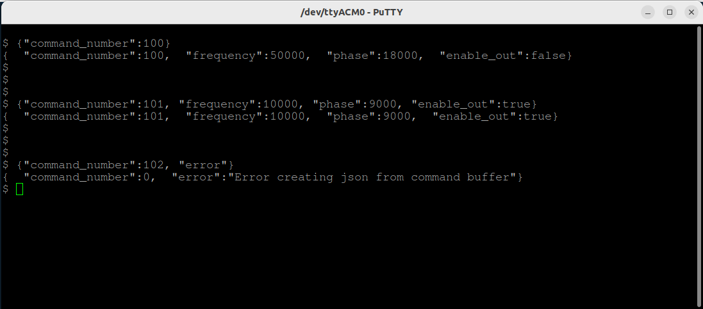

# raspberrypipico-siggen

This repo contains the source code for a signal generator based on one
of the AD9850 DDS modules, controlled by a Raspberry Pi Pico.

## Circuit Schematic

The circuit used is shown below and is, by no means, original.

<div align="center">

</div>

it's powered from the USB connection.  The prototype was built on strip 
board and is shown in the photo below.

<div align="center">

</div>

## Controlling the Signal Generator

The signal generator is controlled via json interfact that was implemented
using Rafa Garcia's [tiny json](https://github.com/rafagafe/tiny-json/tree/master) 
library.  

The JSON schema is given below, along with field definitions.

```
{
    "command_number": <value>,
    "frequency_hz": <value_in_hz>,
    "phase_deg": <value_in_deg>,
    "enable_out": <true_or_false>
}
```

| Field Name       | Description
|------------------|------------------------------------------------
| command_number   | Required numeric field used to identify and acknowledge the command.
| frequency        | Optional field used to set the desired DDS frequency, in Hz.
| phase            | Optional field used to set the desired DDS phase, in increments of .01 deg.
| enable_out       | Optional field that, when set to 'true' enables the DDS output, 'false' disables it.

The JSON can be sent from a script or even built by hand and sent from
a serial terminal.  When a command is sent the signal generator will 
echo it and respond with a JSON string containing the command number 
and current frequency, phase, and DDS output status.  If the JSON 
command cannot be parsed for some reason, the response will contain 
the command_number and an error string.  An example is shown in the 
image below.

<div align="center">

</div>

## Using the Signal Generator

Once the circuit is built, build the C/C++ source and load it into the
Pi Pico as normal.  In the repo there's a Python script that can be 
used for control.  The script can be executed using the command

```
./siggen <command> <option>
```

Available subcommands are:

| Command                           | Description
|-----------------------------------|-------------------------------------
| set_frequency <frequency_in_hz>   | Set the DDS frequency, in Hz
| get_frequency                     | Display the current frequency, in Hz
| set_phase <phase_in_deg>          | Set the DDS phase, in deg
| get_phase                         | Display the current phase, in deg
| enable_out                        | Enable the DDS output
| disable_out                       | Disable the DDS output
| get_state                         | Display the current signal generator state
| help                              | Display available commands

The signal generator defaults to a frequency of 1 kHz with the output 
disabled on startup, and uses the default serial port of 
`/dev/ttyACM0`.  If your port is different you'll have to change 
it in the script.
